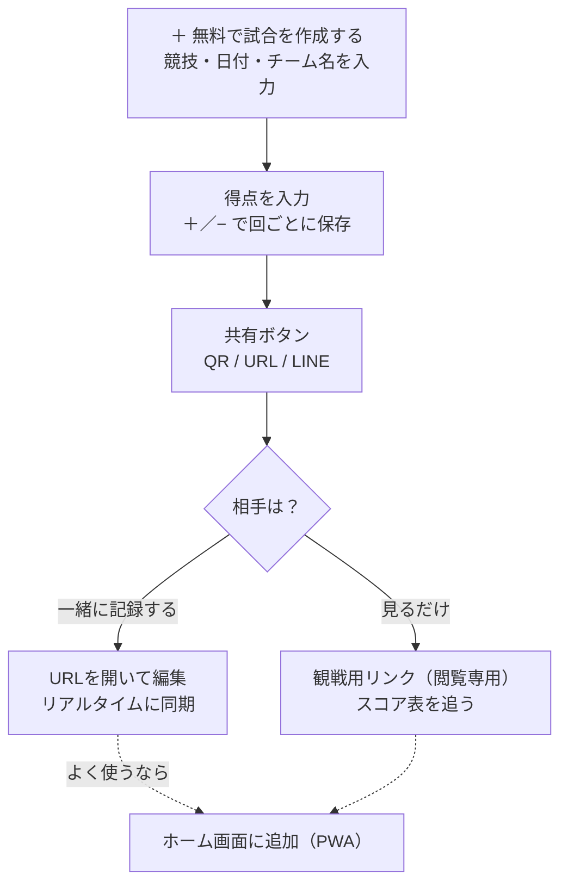
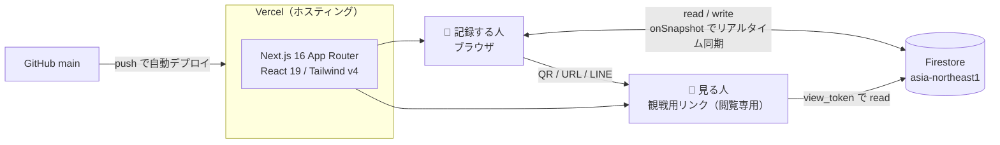
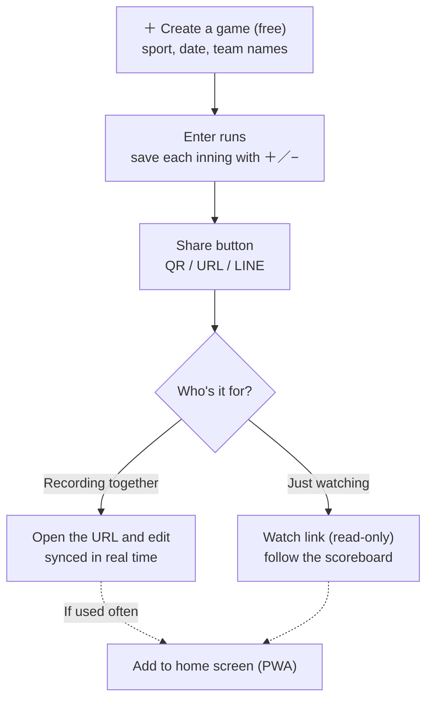
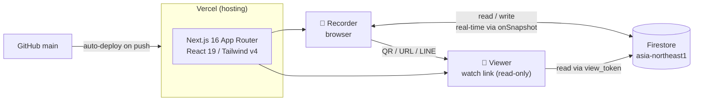

<a name="japanese"></a>

# スコアボ (scorebo) — 野球・ソフトのスコアを記録して、QRで即共有

**日本語** | [English](#english)

スマホで試合のスコアをイニングごとに記録し、**QRコードやURLでその場で共有**できるWebアプリです。野球・ソフトボール・キックベースボールに対応、アカウント登録はいりません。開いてすぐ使えます。

公開先: **https://scorebo.vercel.app**

## 主な機能

- 試合の作成(競技 / 試合日 / 最大回数 / 対戦チーム / 場所)
- イニングごとの得点入力(＋／−のステッパー、過去のイニングもタップで修正)
- **リアルタイム同期** — 同じ試合を開いている全員の画面に、入力がその場で反映
- **QRコード / 短縮URL / LINE** で共有
- **観戦用リンク**(閲覧専用ビュー) — 見る人はスコア表だけを追える
- 試合の終了 / 再開、延長戦(＋イニング追加)、コールド対応
- 試合一覧の検索・競技フィルタ・ページネーション
- スマホのホーム画面に追加できる(PWA)

**こんなときに便利**

たとえば——

- **少年野球の試合を、来られなかった保護者にリアルタイム共有**する(QRを1枚配るだけ)
- **草野球・ソフトの試合を、ベンチのスマホで手早くつける**(紙のスコアブックの代わりに)
- **社内・地域のキックベース大会**で、各コートの経過を1つのURLで見せる
- **試合後に結果をチームのグループLINEへ**そのまま送る

ユーザー向けの詳しい操作は [使い方ガイド (/help)](https://scorebo.vercel.app/help) にまとめてあります。

## 安全性

アカウント登録なしで使える代わりに、共有の仕組みはシンプルです。次の点だけ理解して使ってください。

- **URLを知っている人は、誰でも閲覧も編集もできます**(削除もできます)。パスワードや承認の仕組みはありません。共有する相手・範囲は自分で管理してください。むやみに公開しないのが安全です。
- 見せるだけにしたいときは、共有画面から出せる**観戦用リンク(閲覧専用)**を渡してください。
- 入力したスコアはクラウド(Google の Firestore データベース)に保存され、URLを開いた全員にリアルタイムで同期されます。手元だけのデータではありません。
- ログインは不要ですが、端末には自動で「あなた」を表す匿名の識別子が割り当てられ、**自分が作った試合の一覧**を出すのに使われます。別の端末に引き継ぎたいときのために、リカバリーキー(合言葉)を発行・復元できます。
- 保存されるのは試合スコアと対戦チーム名など、試合に関する情報だけです。個人情報の入力は求めません。

## 使い方

3ステップです。記録する人と、見るだけの人で流れが少し分かれます。



1. **試合を作る** — トップまたは試合一覧の「＋ 無料で試合を作成する」から、競技・試合日・最大回数・対戦チームを入力(先攻・後攻は入力順)。
2. **共有する** — スコア画面右上の「共有」から、QRコード・試合URL・LINE送信ボタンが出ます。見せるだけなら観戦用リンクを渡します。
3. **記録する** — ＋／− で得点を入れて「N回を保存する」。延長は「＋ イニングを追加」、締めは「🏁 試合を終了」。

よく使うなら、ブラウザの「ホーム画面に追加」でアプリのように起動できます(PWA)。細かい操作や FAQ は [/help](https://scorebo.vercel.app/help) を参照してください。

---

## 技術解説(エンジニア向け)

サーバーを持たず、ブラウザから直接 **Firestore** を読み書きする構成です。得点の入力は `onSnapshot` のリアルタイムリスナーを通じて、同じ試合を開いている全クライアントに即座に配信されます。ホスティングは Vercel、`main` への push で自動デプロイされます。



- **認証**：Firebase の匿名認証で端末ごとに `owner_uid` を発行。これで「自分が作った試合」を絞り込む。試合ドキュメント自体は誰でも読み書きできる(下記ルール参照)。
- **共有**：試合作成時に `view_token`(ランダムID)を払い出し、`view_tokens/{token}` から試合IDを引けるようにする。`/watch/[viewToken]` はこのトークン経由で**閲覧専用**にスコアを購読する。
- **リアルタイム**：`watchGame` / `watchGameByViewToken` が Firestore の `onSnapshot` を張り、得点更新を全クライアントへ push。
- **ID の引き継ぎ**：リカバリーキーを発行すると、そのハッシュを `identities`(Admin SDK 専用で書き込み)に保存。別端末で復元すると `owner_uid` を引き継げる。

**ディレクトリ構成**

```
app/
  _components/      共有コンポーネント (BrandMark, ScoreTable, SportIcon ほか)
  games/
    new/            試合作成フォーム
    [id]/           試合詳細・スコア入力 (リアルタイム同期)
    sample/         サンプル試合
  watch/[viewToken]/  観戦用の閲覧専用ビュー
  keys/ · settings/keys · restore/  リカバリーキーの発行・設定・復元
  help/ · privacy/ · terms/         使い方・プライバシー・利用規約
  api/              キー操作 / OG 画像の Route Handler
  layout.tsx · page.tsx · manifest.ts · opengraph-image.tsx
lib/
  firebase.ts       Firebase 初期化 (client)
  games.ts          Firestore CRUD・スコア計算ヘルパ
  sports.ts         競技マスタ (野球/ソフト/キック)
  types.ts          型定義
  keys-client.ts · keys-server.ts · admin.ts  リカバリーキー関連
firestore.rules     Firestore セキュリティルール
firebase.json       Firebase CLI 設定
```

**ローカル開発**

```bash
npm install
# .env.local に Firebase Web アプリの設定を記入 (下記)
npm run dev          # http://localhost:3000
```

`.env.local` には自分の Firebase プロジェクトの Web アプリ設定を入れます(コンソール > プロジェクト設定 > 全般 > マイアプリ)。

```
NEXT_PUBLIC_FIREBASE_API_KEY=
NEXT_PUBLIC_FIREBASE_AUTH_DOMAIN=
NEXT_PUBLIC_FIREBASE_PROJECT_ID=
NEXT_PUBLIC_FIREBASE_STORAGE_BUCKET=
NEXT_PUBLIC_FIREBASE_MESSAGING_SENDER_ID=
NEXT_PUBLIC_FIREBASE_APP_ID=
```

**デプロイ**

- Vercel に `main` ブランチを連携済み。`main` への push で本番へ自動デプロイ、Pull Request にはプレビュー URL が払い出される。
- Firestore ルールの反映は Firebase CLI で行う: `npx firebase deploy --only firestore:rules`(初回は `npx firebase login`)。
- ビルド確認用に、各ページ HTML へ `<meta name="x-build">` としてビルド日時を埋め込んでいる(`curl -s https://scorebo.vercel.app/ | grep x-build`)。

**データモデル**(`games` コレクション = 1試合1ドキュメント)

| フィールド | 型 | 説明 |
| --- | --- | --- |
| `sport` | `'baseball' \| 'softball' \| 'kickball'` | 競技 |
| `date` | string (`YYYY-MM-DD`) | 試合日 |
| `location` | string | 場所(任意) |
| `team_top` / `team_bottom` | string | 先攻 / 後攻チーム |
| `max_innings` | number | 最大回数(UI は1〜9、延長は追加) |
| `innings` | `{ inning, top, bottom }[]` | イニングごとの得点 |
| `status` | `'in_progress' \| 'completed'` | 進行中 / 終了 |
| `view_token` | string | 観戦用リンクのトークン |
| `owner_uid` | string | 作成者の匿名UID(任意) |
| `created_at` / `updated_at` | Timestamp | 作成 / 更新(サーバータイム) |

<details>
<summary><b>制約・メモ</b></summary>

- `games` は誰でも read / write / delete 可(`firestore.rules` で `allow: if true`)。ただし書き込み時にフィールド形状(sport の列挙、最大回数 1〜30、文字列長、`created_at` 改ざん禁止、`updated_at` は単調増加)を検証する。アクセス制御は「URL(トークン)を知っているか」だけで、認可レイヤーは持たない。
- `identities`(リカバリーキー)はクライアントから書き込めず、Admin SDK 経由の API Route のみが更新する。クライアントは自分の識別子ドキュメントを read できるだけ。
- シーズン年表(`/timeline`)は準備中の画面で、まだ本実装ではない。

</details>

<details>
<summary><b>うまくいかないとき</b></summary>

- **得点が反映されない / 同期されない** → 通信状況を確認してページを再読み込み。オフライン時は反映されないことがある。
- **`npm run dev` で Firebase 初期化に失敗する** → `.env.local` の `NEXT_PUBLIC_FIREBASE_*` が未設定・不一致。Firebase コンソールの Web アプリ設定と突き合わせる。
- **共有した試合を勝手に編集された** → 仕様上、URLを知る人は編集できる。見せるだけなら観戦用リンク(閲覧専用)を渡し、編集用URLの共有範囲を絞る。

</details>

## 対応環境

- **スマホのモバイルブラウザ前提**(iOS Safari / Android Chrome など、モダンブラウザ)。PC ブラウザでも動作する。
- ブラウザの「ホーム画面に追加」でアプリのように起動できる(PWA)。
- 開発時のスタック: **Next.js 16.2**(App Router) / **React 19.2** / **Tailwind CSS v4** / **Firebase 12**。**Node.js 20 以上**(開発は Node 25 で確認)。

## ライセンス / 利用について

個人開発のプロジェクトです(`package.json` は `private`、明示ライセンスは付けていません)。フィードバックやバグ報告は GitHub の Issue / Pull Request にてお願いします。

---

<a name="english"></a>
# scorebo — record baseball/softball scores and share them instantly by QR

[日本語](#japanese) | **English**

A web app for recording game scores inning by inning on your phone and **sharing them on the spot via QR code or URL**. Supports baseball, softball, and kickball, with no account required — open it and start.

Live: **https://scorebo.vercel.app**

## What it does

- Create a game (sport / date / max innings / teams / location)
- Enter runs per inning (＋／− steppers; tap a past inning to fix it)
- **Real-time sync** — input shows up instantly on every device viewing the same game
- Share by **QR code / short URL / LINE**
- A **watch link** (read-only view) — viewers just follow the scoreboard
- Finish / resume a game, extra innings (＋add inning), called-game handling
- Search, sport filter, and pagination on the game list
- Add to your phone's home screen (PWA)

**Handy when you want to**

For example —

- **Share a kids' baseball game live with parents who couldn't come** (just hand out one QR)
- **Keep score quickly from the bench on a phone** in a rec-league game, instead of a paper scorebook
- **Show the progress of each court at a community kickball tournament** through one URL
- **Send the final result straight to the team's LINE group** after the game

Detailed instructions live on the [help page (/help)](https://scorebo.vercel.app/help).

## Safety

The trade-off for needing no account is a simple sharing model. Just keep these in mind:

- **Anyone who knows the URL can both view and edit** (and delete) the game. There's no password or approval step. You manage who you share with — not making it public is the safe default.
- To let people only look, hand out the **watch link (read-only)** from the share screen.
- Scores are saved to the cloud (Google's Firestore database) and synced in real time to everyone who has the URL — the data isn't local-only.
- No login, but your device is automatically assigned an anonymous identifier used to list **the games you created**. You can issue/restore a recovery key to carry that identity to another device.
- Only game-related info is stored (scores, team names, etc.). No personal information is requested.

## Usage

Three steps. The flow splits a little between people who record and people who just watch.



1. **Create a game** — from "＋ Create a game (free)" on the top or list page, enter sport, date, max innings, and teams (batting order follows input order).
2. **Share** — the "Share" button (top-right of the score screen) shows a QR code, the game URL, and a LINE button. For view-only, hand out the watch link.
3. **Record** — set runs with ＋／− and press "Save inning N". Add extra innings with "＋ Add inning"; close it out with "🏁 Finish game".

If you use it a lot, "Add to home screen" launches it like an app (PWA). For finer operations and FAQ, see [/help](https://scorebo.vercel.app/help).

---

## How it works (for engineers)

No backend of its own — the browser reads and writes **Firestore** directly. Score edits are pushed to every client viewing the same game through an `onSnapshot` real-time listener. Hosting is on Vercel, with automatic deploys on push to `main`.



- **Auth**: Firebase anonymous auth issues a per-device `owner_uid`, used to filter "games you created". The game documents themselves are world-readable/writable (see rules below).
- **Sharing**: on creation a random `view_token` is minted; `view_tokens/{token}` maps back to the game ID. `/watch/[viewToken]` subscribes to the score **read-only** through that token.
- **Real-time**: `watchGame` / `watchGameByViewToken` attach a Firestore `onSnapshot` listener and push score updates to all clients.
- **Identity handoff**: issuing a recovery key stores its hash in `identities` (writable only by the Admin SDK). Restoring on another device carries the `owner_uid` over.

**Directory layout**

```
app/
  _components/      shared components (BrandMark, ScoreTable, SportIcon, ...)
  games/
    new/            create-game form
    [id]/           game detail + score entry (real-time sync)
    sample/         sample game
  watch/[viewToken]/  read-only watch view
  keys/ · settings/keys · restore/  recovery-key issue / settings / restore
  help/ · privacy/ · terms/         help, privacy, terms
  api/              route handlers for keys / OG images
  layout.tsx · page.tsx · manifest.ts · opengraph-image.tsx
lib/
  firebase.ts       Firebase init (client)
  games.ts          Firestore CRUD + score helpers
  sports.ts         sport master (baseball/softball/kickball)
  types.ts          type definitions
  keys-client.ts · keys-server.ts · admin.ts  recovery-key logic
firestore.rules     Firestore security rules
firebase.json       Firebase CLI config
```

**Local development**

```bash
npm install
# fill .env.local with your Firebase web app config (below)
npm run dev          # http://localhost:3000
```

Put your own Firebase project's web app config in `.env.local` (Console > Project settings > General > Your apps):

```
NEXT_PUBLIC_FIREBASE_API_KEY=
NEXT_PUBLIC_FIREBASE_AUTH_DOMAIN=
NEXT_PUBLIC_FIREBASE_PROJECT_ID=
NEXT_PUBLIC_FIREBASE_STORAGE_BUCKET=
NEXT_PUBLIC_FIREBASE_MESSAGING_SENDER_ID=
NEXT_PUBLIC_FIREBASE_APP_ID=
```

**Deployment**

- The `main` branch is linked to Vercel: push to `main` auto-deploys to production, and pull requests get a preview URL.
- Deploy Firestore rules with the Firebase CLI: `npx firebase deploy --only firestore:rules` (`npx firebase login` on first use).
- A build timestamp is embedded in each page's HTML as `<meta name="x-build">` (`curl -s https://scorebo.vercel.app/ | grep x-build`).

**Data model** (`games` collection = one document per game)

| Field | Type | Description |
| --- | --- | --- |
| `sport` | `'baseball' \| 'softball' \| 'kickball'` | sport |
| `date` | string (`YYYY-MM-DD`) | game date |
| `location` | string | location (optional) |
| `team_top` / `team_bottom` | string | first / second batting team |
| `max_innings` | number | max innings (UI 1–9; extras added on top) |
| `innings` | `{ inning, top, bottom }[]` | runs per inning |
| `status` | `'in_progress' \| 'completed'` | in progress / finished |
| `view_token` | string | token for the watch link |
| `owner_uid` | string | creator's anonymous UID (optional) |
| `created_at` / `updated_at` | Timestamp | created / updated (server time) |

<details>
<summary><b>Constraints & notes</b></summary>

- `games` allows read / write / delete for anyone (`allow: if true` in `firestore.rules`), but writes are shape-validated (sport enum, max innings 1–30, string lengths, `created_at` tamper-proof, `updated_at` monotonic). Access control is solely "do you know the URL (token)"; there is no authorization layer.
- `identities` (recovery keys) can't be written from the client — only Admin-SDK-backed API routes update them. The client can only read its own identity document.
- The season timeline (`/timeline`) is a placeholder screen, not yet implemented.

</details>

<details>
<summary><b>Troubleshooting</b></summary>

- **Scores don't update / sync** → check connectivity and reload. Offline changes may not be reflected.
- **Firebase init fails on `npm run dev`** → `NEXT_PUBLIC_FIREBASE_*` in `.env.local` is missing or mismatched. Reconcile with the Firebase console's web app config.
- **A shared game got edited by someone** → by design, anyone with the URL can edit. For view-only, hand out the watch link (read-only) and limit who gets the editable URL.

</details>

## Supported environment

- **Built for mobile browsers** (iOS Safari / Android Chrome and other modern browsers). Works in desktop browsers too.
- "Add to home screen" launches it like an app (PWA).
- Development stack: **Next.js 16.2** (App Router) / **React 19.2** / **Tailwind CSS v4** / **Firebase 12**. **Node.js 20+** (developed on Node 25).

## License / usage

A personal project (`package.json` is `private`, no explicit license attached). Feedback and bug reports are welcome via GitHub Issues / Pull Requests.
